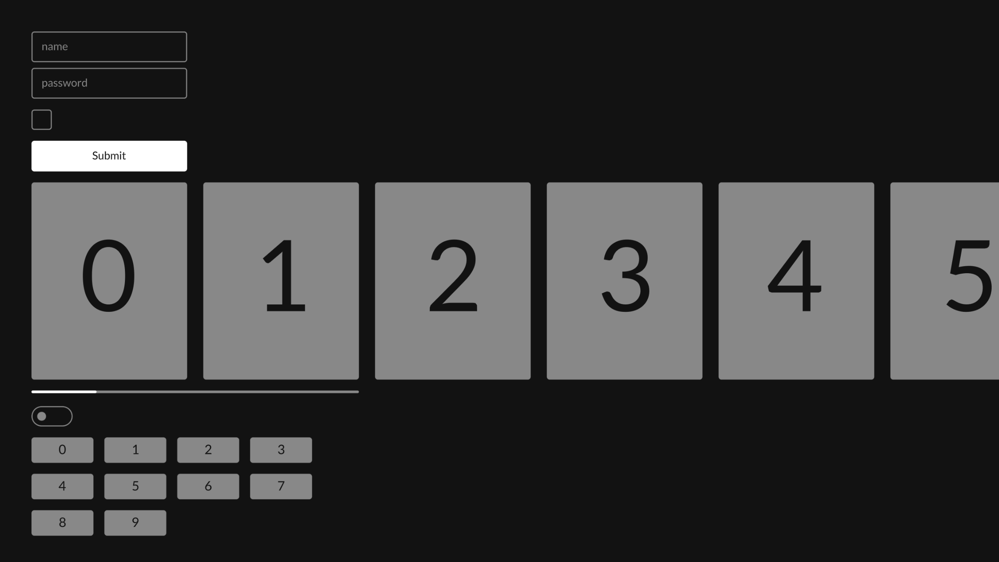

# Blits Components

This repository contains a set of _off-the-shelf_ reference Blits Components, that you can **copy** and **paste**, and use freely in your own projects.

The components are built with performance in mind and are designed to be adapted and customized to the needs and design of your own App.

## Available components

- Input / Password input
- Checkbox
- Button
- List
- Progress bar
- Toggle
- Grid

### How to use

As the Blits reference Components are intended to be copy-pasted into your App, there is no specific installation procedure required.

You can check out the source of each of the available component here [/src/components/](/src/components/). Choose a component that matches most what your looking for and copy it over to your own Blits app.

Now you can start customizing it - change the look and feel and add or modify functionality based on your specific App needs.

These Blits components purposely don't contain every possible feature and functionality, because in practice your App might not need all of that, but the code will still be there - instead we've kept them basic and simple, allowing you to take them as a good starting point.

### Bugs, issues or suggestions?

If you find any bugs or issues, or if you have suggestions for new components to be added to this repository, please feel free to file a GitHub issue or open a PR.
